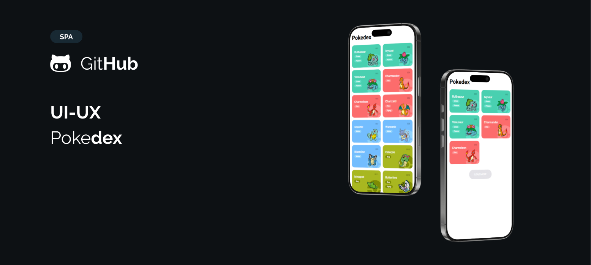

# Pokédex Web

Este projeto é uma Pokédex interativa feita com **HTML, CSS e JavaScript**, que consome dados da [PokéAPI](https://pokeapi.co/) para exibir uma lista de Pokémons com seus respectivos tipos, número e imagens.



## Funcionalidades

- Listagem dinâmica de Pokémons usando a API pública da PokéAPI.
- Carregamento incremental de Pokémons (botão "Load More").
- Exibição do nome, número, tipos e imagem SVG de cada Pokémon.
- Estilização dinâmica com base no tipo do Pokémon (ex: `.grass`, `.fire`, etc.).

## Tecnologias utilizadas

- HTML
- CSS
- JavaScript (ES6)
- [PokéAPI](https://pokeapi.co/)

## Estrutura do Projeto

### `Pokemon` (classe)
Define o modelo base dos dados do Pokémon:
```js
class Pokemon {
  number;
  name;
  type;
  types = [];
  photo;
}
````

### `convertPokeApiDetailToPokemon(pokeDetail)`

Função que transforma os dados da PokéAPI no formato esperado pelo app.

### `api.getPokemons(offset, limit)`

Função que busca uma lista de Pokémons e seus detalhes com base em `offset` e `limit`.

### `loadPokemonItens(offset, limit)`

Renderiza os Pokémons na tela em cards personalizados.

### Paginação

A cada clique no botão **"Load More"**, mais Pokémons são carregados até o limite de 25.

## Como usar

1. Clone o repositório:

   ```bash
   git clone https://github.com/srf-dev/Pokedex.git
   ```

2. Abra o arquivo `index.html` no navegador.

Não é necessário backend ou servidor — o projeto é 100% client-side.

## Autor

Feito com 💜 por Shayare 🐈
